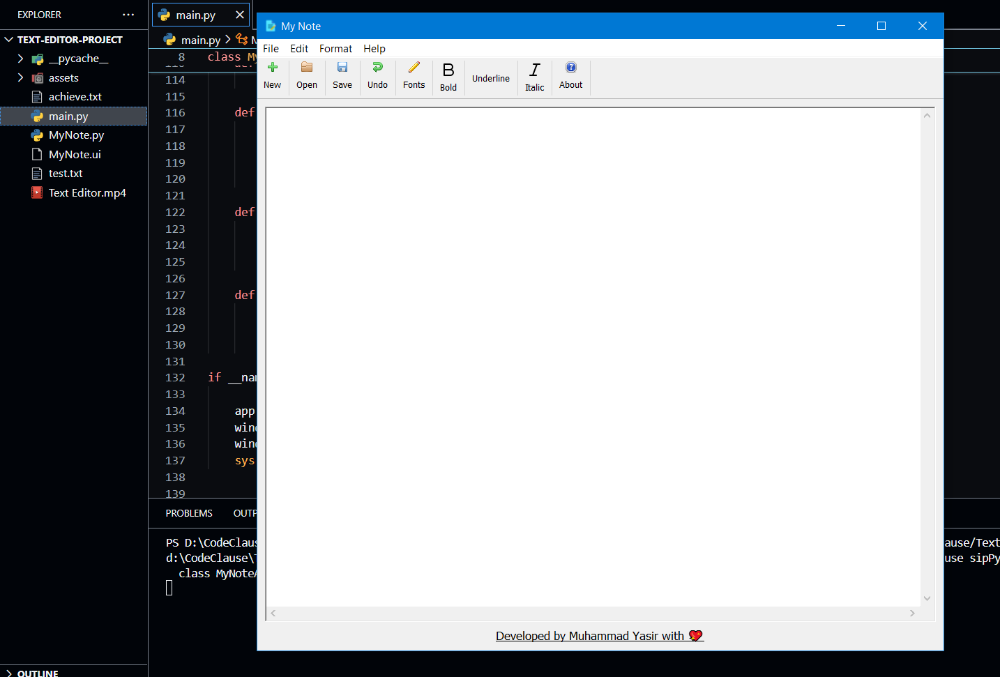

# 📝 PyQt5 Text Editor

A simple yet functional **Text Editor** built using **Python, PyQt5, and Qt Designer**. This GUI-based editor offers core features such as creating, opening, saving, and editing text files — with formatting options like bold, italic, font selection, and more.

## 💡 Features

✅ **New File** – Start with a blank document  
✅ **Open File** – Load and edit `.txt` files  
✅ **Save File** – Save your work in `.txt` format  
✅ **Copy, Cut, Paste** – Classic clipboard operations  
✅ **Undo/Redo** – Easily revert or reapply changes  
✅ **Select All** – Highlight the entire text  
✅ **Font Customization** – Change font family, size, and style  
✅ **Bold / Italic / Underline** – Format your text with basic styling options  
✅ **Toolbar & Menu** – Well-organized access to features  
✅ **About Dialog** – App information popup  
✅ **Exit Confirmation** – Prompts before closing unsaved work

## 🧰 Tech Stack

- **Python 3.x**
- **PyQt5**
- **Qt Designer** (for GUI layout)

## 📸 Screenshot

> `

🧑‍💻 Author
Muhammad YASIR
email:`[yaisikhan111@gmail.com]
